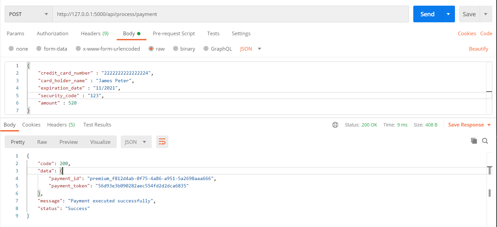

# Flask API architecture (Scalable)

## Create virtual environment
#### macOS and Linux:
```
python3 -m venv env
```
#### Windows:
```
c:\>python -m venv c:\path\to\env
```
----------------
## Activate virtual environment
#### macOS and Linux:
```
source env/bin/activate
```
#### Windows:
```
.\env\Scripts\activate
```
-----

## Install packages
```
python manage.py createsuperuser
```
------------

## Run Flask
```
python main.py
```
Server will start at  http://127.0.0.1:5000/ 

-----------


-------------
## Run Testcase
```
python -m unittest tests\test_payment.py
```
